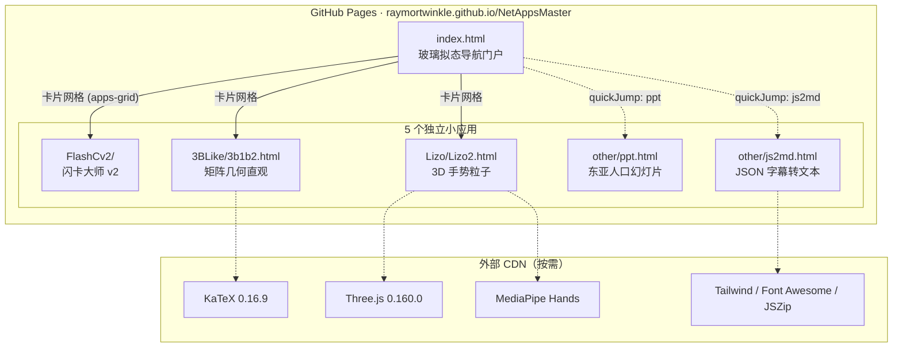
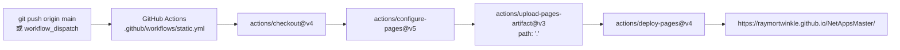
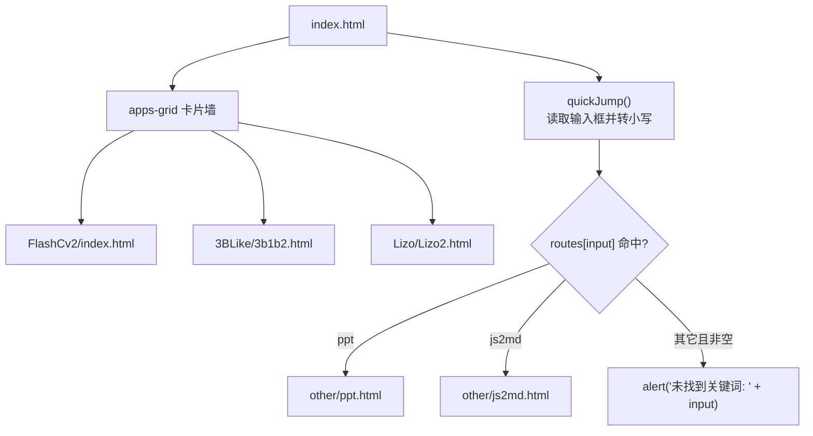
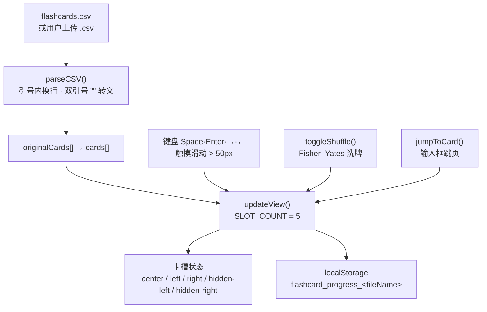
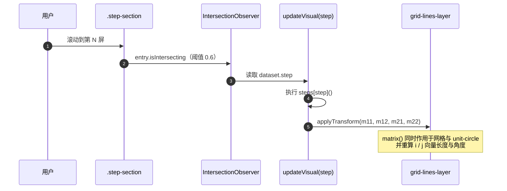
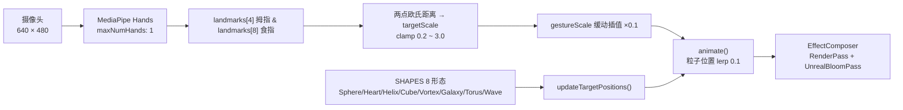
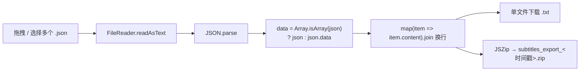

<div align="center">

> [English](./README_en.md) | **简体中文**


# NetAppsMaster · 网页小玩具合集

**一个入口，打开五个即开即玩的 Web 小应用 —— 零安装、零构建、纯静态。**

纯 HTML / CSS / JavaScript 写就的静态作品集：打开 `index.html` 就是导航门户，
每张小卡片背后都是一个独立的小工具——从 CSV 闪卡、3B1B 风格线性代数动画，
到摄像头手势粒子、纯 CSS 幻灯片和字幕批处理。


</div>

---

## 它解决什么问题

Ray 做了一堆「网页娱乐小玩具」，但它们散落各处、没有统一入口——想玩哪一个都要先找到对应的文件或链接。
把每个玩具单独发出去分享，既不好记也不好找。

**NetAppsMaster 把它们拢成一座「静态应用门户」：** 根目录的 `index.html` 用一面玻璃拟态卡片墙展示所有应用，
另配一个关键词快速跳转入口；每个应用各自待在独立子目录里，互不依赖，可以单独打开、单独分享。
整站只有静态文件，推到 GitHub 后由 Actions 自动发布到 GitHub Pages，全程**没有构建步骤、没有打包器、没有 `node_modules`**。

> 全部逻辑跑在你的浏览器里。唯一需要联网的是几个 CDN 库（KaTeX / Three.js / MediaPipe 等），
> 以及需要摄像头权限的手势粒子应用。

---

## ✨ 功能

- 🧭 **玻璃拟态导航首页**：`index.html` 用卡片网格陈列全部应用；内置 `quickJump()` 关键词跳转（输入 `ppt` / `js2md` 直达对应页面）。
- 🎴 **闪卡大师 v2（FlashCv2）**：上传任意 `.csv` 即可用 5 槽 CoverFlow 卡片流学习，支持翻面、乱序（Fisher–Yates）、跳页，并用 `localStorage` 记住每份文件的进度。
- 📐 **矩阵几何直观（3BLike）**：3Blue1Brown 风格的滚动式线性代数教学。左侧固定舞台随滚动实时做矩阵变换，KaTeX 渲染公式，覆盖正交 / 实对称 / 相似对角化 / 二次型 / 解题策略共 9 屏。
- 🎨 **Lizo2 增强版**：Three.js + MediaPipe Hands 的 3D 手势粒子系统。捏合拇指与食指即可缩放，内置 8 种几何形态与 3 种色彩模式，带 UnrealBloom 辉光后处理。
- 📊 **东亚人口演示幻灯片（other/ppt.html）**：纯 CSS/HTML 写的 8 页 16:9 演示文稿，方向键翻页、按钮全屏，深色沉浸式排版。
- 🗂️ **JSON 字幕转纯文本（other/js2md.html）**：拖拽多个 `.json` 字幕批量提取 `content` 字段，逐个下载 `.txt` 或用 JSZip 打包成 `.zip`，全程在本地浏览器完成、不上传服务器。

---

## 🚀 快速开始

### 方式一：面向 AI Agent（一键提示词）

把下面这段直接发给你的本地 AI Agent（Claude Code / Codex / OpenCode …）：

````markdown
请帮我在本地跑起 NetAppsMaster（GitHub: https://github.com/RayMorTwinkle/NetAppsMaster）。
背景：这是一个纯静态的网页小玩具合集，根目录 index.html 是导航门户，无需构建、无依赖。

步骤：
1. 克隆：git clone https://github.com/RayMorTwinkle/NetAppsMaster.git && cd NetAppsMaster
2. 起一个本地静态服务器（手势粒子应用需要 localhost 才能拿到摄像头权限）：
   python3 -m http.server 8000
3. 打开 http://localhost:8000 —— 应看到玻璃拟态卡片墙，含闪卡大师 v2 / 矩阵几何直观 / Lizo2 三个入口。
4. 逐个验证：点击卡片能进入对应页面；在首页关键词框输入 ppt、js2md 能跳转。
5. 向用户简述 5 个应用各自是什么，并提示 Lizo2 需要授权摄像头。
````

### 方式二：面向人类用户

```bash
git clone https://github.com/RayMorTwinkle/NetAppsMaster.git
cd NetAppsMaster

# 任选其一：
open index.html                 # 直接双击打开（Lizo2 的摄像头在 file:// 下可能不可用）
python3 -m http.server 8000     # 或起本地服务，访问 http://localhost:8000（推荐）
```

> **环境要求**：任意现代浏览器即可，**无需安装任何依赖、无需构建**。
> 联网时各应用从 CDN 加载 KaTeX / Three.js / MediaPipe / Tailwind / Font Awesome / JSZip；
> `Lizo/Lizo2.html` 需要**摄像头权限**，建议通过 `localhost` 或 HTTPS 访问（浏览器安全上下文限制）。

---

## 🖥️ 使用

### 五个应用一览

| 入口 | 名称 | 打开方式 | 一句话能力 |
|---|---|---|---|
| `index.html` | 导航首页 | 站点根路径 | 卡片墙 + 关键词快速跳转 |
| `FlashCv2/index.html` | 闪卡大师 v2 | 首页卡片 🚀 | CSV 闪卡 CoverFlow + 进度记忆 |
| `3BLike/3b1b2.html` | 矩阵几何直观 | 首页卡片 📐 | 滚动驱动的线代可视化教学 |
| `Lizo/Lizo2.html` | Lizo2 增强版 | 首页卡片 🎨 | 手势控制的 3D 粒子 |
| `other/ppt.html` | 东亚人口幻灯片 | 首页关键词 `ppt` | 8 页 CSS 演示文稿 |
| `other/js2md.html` | JSON 字幕转文本 | 首页关键词 `js2md` | 批量 `.json` → `.txt` / `.zip` |

> 注：`ppt.html` 与 `js2md.html` **不在首页卡片墙上**，只能通过首页「快速跳转」输入关键词进入（`index.html` 中的 `routes`）。

### 典型操作

```text
闪卡大师 v2
──────────
1. 打开 FlashCv2/index.html
2. 点「示例词汇」直接体验，或点「选择文件」上传自己的 .csv（两列：问题,答案）
3. Space 翻面 · Enter / → 下一张 · ← 上一张 · 输入框跳页 · 随机按钮乱序
4. 关闭页面后再打开同一文件，会自动回到上次的位置

矩阵几何直观
──────────
向下滚动右栏：正交矩阵 → 实对称矩阵 → 相似对角化 P D P⁻¹ → 三大性质 → 二次型 → 解题四步
左栏舞台会随当前屏实时重绘网格、单位圆、i / j 基向量与两条特征轴

Lizo2 视角手势
──────────
1. 打开后点加载遮罩，授权摄像头
2. 捏合拇指与食指缩放粒子团 · 鼠标左键拖拽旋转 · 滚轮缩放
3. 左侧控制台切换 8 种形态、3 种配色，拖动粒子密度 / 辉光滑块

JSON 字幕转文本
──────────
拖入一个或多个 .json（形如 [{content:"..."}] 或 {data:[{content:"..."}]}）
→ 逐个下载 .txt，或「打包下载全部 (.zip)」
```

---

## 🏗️ 架构

### 系统总览

整站是「一门户 + 五应用」的静态结构，各子应用彼此独立；外部 CDN 库按需加载。



### 部署流水线

每次推送到 `main`（或手动触发）都会由 GitHub Actions 把**整个仓库根目录**作为 Pages 产物发布。



### 首页导航路由

首页两条路径：卡片直连，以及 `quickJump()` 关键词路由表。



### 闪卡数据流（FlashCv2）

CSV 经加强版解析器进入内存，5 个卡槽按「距中心的距离」分配 `center / left / right / hidden-*` 状态。



### 矩阵教学的滚动驱动（3BLike）

右侧滚动内容通过 `IntersectionObserver`（`threshold: 0.6`）驱动左侧视觉舞台。



### 手势粒子管线（Lizo2）

摄像头帧 → MediaPipe Hands 关键点 → 捏合距离 → 缓动缩放 → 粒子向目标位置插值 → 辉光合成。



### JSON 字幕转换（js2md）



---

## 📂 目录结构

```text
NetAppsMaster/
├── index.html                 # 导航门户：卡片墙 + quickJump 关键词路由
├── assets/
│   └── logo.svg               # 站点图标（layers 符号）
├── FlashCv2/                  # 应用 1：闪卡大师 v2
│   ├── index.html             #   上传界面 + CoverFlow 主界面
│   ├── styles.css             #   玻璃拟态卡片与 3D 舞台样式
│   ├── script.js              #   CSV 解析 / 卡槽渲染 / 进度记忆 / 洗牌
│   └── flashcards.csv         #   预设题库（计算机基础知识，约 310 行）
├── 3BLike/
│   └── 3b1b2.html             # 应用 2：矩阵几何直观（单文件，内联 CSS/JS）
├── Lizo/
│   └── Lizo2.html             # 应用 3：3D 手势粒子（单文件，ES Module）
├── other/
│   ├── ppt.html               # 应用 4：东亚人口演示文稿（单文件）
│   └── js2md.html             # 应用 5：JSON 字幕转文本（单文件）
└── .github/
    └── workflows/
        └── static.yml         # GitHub Pages 自动部署工作流
```

---

## 🔧 技术细节

**零构建的纯静态站。** 仓库内没有 `package.json`、没有打包器、没有 `node_modules`；`static.yml` 直接把 `path: '.'`（整个仓库根目录）作为 Pages 产物上传，因此**仓库里的任何文件都会原样发布**。

**部署触发条件。** 工作流 `on.push.branches: ["main"]` + `workflow_dispatch`（可手动触发）；权限为 `contents: read` / `pages: write` / `id-token: write`，并发组为 `"pages"`（`cancel-in-progress: false`）。

**首页关键词路由表。** `index.html` 内联脚本 `quickJump()` 将输入转小写后查表：

| 关键词 | 目标 |
|---|---|
| `ppt` | `other/ppt.html` |
| `js2md` | `other/js2md.html` |

**闪卡 CoverFlow 的槽位算法。** `SLOT_COUNT = 5`（`script.js`）。`updateView()` 用 `dist = slotIndex - (currentIndex % slotCount)` 量化到 `[-2, 2]`，据此给卡槽加 `center` / `left` / `right` / `hidden-left` / `hidden-right` 类；点击中心翻转、点击左/右切换上一张/下一张。

**闪卡解析与持久化。** `parseCSV()` 手写状态机，处理 `\r\n`/`\r` 归一化、引号内换行与 `""` 转义，产出 `{q, a}` 数组。进度键为 ``flashcard_progress_${fileName}``，仅非乱序状态写入。预设题库通过 `fetch('flashcards.csv')` 加载，失败时回退到内置的 `getExampleCSVContent()`。

**3B1B 视觉变换。** 网格 `range = 20`、`spacing = 50px`。`applyTransform(m11, m12, m21, m22)` 把 `matrix()` 应用到 `#grid-lines-layer`（**单位圆 `#unit-circle` 也是它的子元素**，所以会一起形变），并据变换后长度/角度重算 `#vec-i`、`#vec-j`。舞台用 `gridWorld.style.transform = "scaleY(-1)"` 翻转 Y 轴以符合数学习惯。步骤 0–8 由 `steps` 对象驱动，关键矩阵：正交 `Q`（cos/sin 45°）、实对称 `A = [[2,1],[1,2]]`、对角 `D = [[3,0],[0,1]]`。

**Lizo2 关键参数。** `MAX_PARTICLES = 60000`，默认 `CONFIG.particleCount = 20000`（滑块范围 1000–50000），默认辉光 `bloomStrength = 0.8`（范围 0–3）。手势缩放取自拇指(4)与食指(8)关键点的欧氏距离 `d`，`targetScale = clamp(d * 5, 0.2, 3.0)`，再用 `+= (target - current) * 0.1` 缓动。渲染链为 `EffectComposer`：`RenderPass → UnrealBloomPass`；控制器为 `OrbitControls`（`dampingFactor 0.05`）。Three.js 版本由 `importmap` 锁到 `0.160.0`。

**幻灯片与字幕工具的边界处理。** `ppt.html` 为固定 `1280×720` 舞台，键盘监听 `ArrowRight / Space / Enter` 下一页、`ArrowLeft` 上一页。`js2md.html` 只接受扩展名为 `.json` 的文件，兼容「顶层数组」与「`{data: []}`」两种结构，仅提取每项的 `content` 字段并用换行拼接。

---

## ❓ 常见问题

**Q：需要安装什么吗？**
A：什么都不用。纯静态文件，双击 `index.html` 或起个静态服务器即可；没有依赖、没有构建步骤。

**Q：Lizo2 打不开摄像头 / 提示启动失败？**
A：浏览器只在**安全上下文**下授予摄像头权限。请通过 `http://localhost:8000` 或 HTTPS 访问，不要用 `file://` 直接打开；并确认已在弹窗中允许摄像头。

**Q：闪卡支持什么格式的 CSV？**
A：两列 `问题,答案`。解析器支持字段用双引号包裹、引号内包含换行，以及用 `""` 表示一个字面双引号（详见 `parseCSV()`）。

**Q：为什么首页看不到 `ppt` 和 `js2md`？**
A：它们没有做成卡片，需在首页「快速跳转」框输入关键词 `ppt` 或 `js2md` 进入。

**Q：上传的文件会被传到服务器吗？**
A：不会。闪卡与字幕工具都基于浏览器 `FileReader` / `Blob` 在本地处理，页面文案也明确写着「文件不会上传到任何服务器」。

---

## ⚠️ 注意事项

- **联网依赖**：多个应用从公共 CDN 加载第三方库（KaTeX、Three.js、MediaPipe、Tailwind、Font Awesome、JSZip）。离线或 CDN 被墙时，对应功能会不可用。
- **`Lizo/Lizo2.html` 残留了 AI Studio 脚手架引用**：文件尾部引用了 `/index.css`、`/index.tsx`，并 `preconnect` 了 `aistudiocdn.com`。这些路径在仓库中**并不存在**，会在控制台产生 404，但不影响主要功能。（待确认是否为有意保留）
- **`other/ppt.html` 的配图为占位链接**：`` 指向的是占位资源，实际很可能无法显示；文稿的文字内容是完整的。
- **第三方素材版权**：幻灯片、预设题库等包含第三方内容，二次分发请注意版权。
- **本仓库无许可证文件**，默认保留所有权利（见下）。

---

## 📄 License

本仓库当前**未附带开源许可证文件**。在补充许可证（如 MIT）之前，默认保留所有权利；如需对外复用，请先联系作者。

---

## 🙏 致谢 / Credits

- **3B1B 交互式线代的教学结构**致敬 [3Blue1Brown](https://www.3blue1brown.com/) 的线性代数系列；数学公式由 [KaTeX](https://katex.org/) 渲染。
- **Lizo2** 建立在 [Three.js](https://threejs.org/) 与 [MediaPipe Hands](https://developers.google.com/mediapipe) 之上。
- **FlashCv2** 的图标来自 [Font Awesome](https://fontawesome.com/)；**js2md** 的打包下载依赖 [JSZip](https://stuk.github.io/jszip/)；页面样式部分使用 [Tailwind CSS](https://tailwindcss.com/)。
- 站点图标、README（中英双语）与架构图为本仓库重制。

---

<div align="center">
<sub>NetAppsMaster · 把所有小玩具，装进一扇门</sub>
</div>
