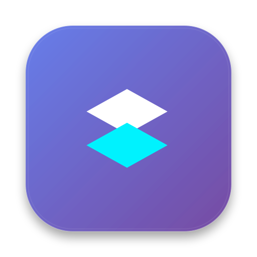
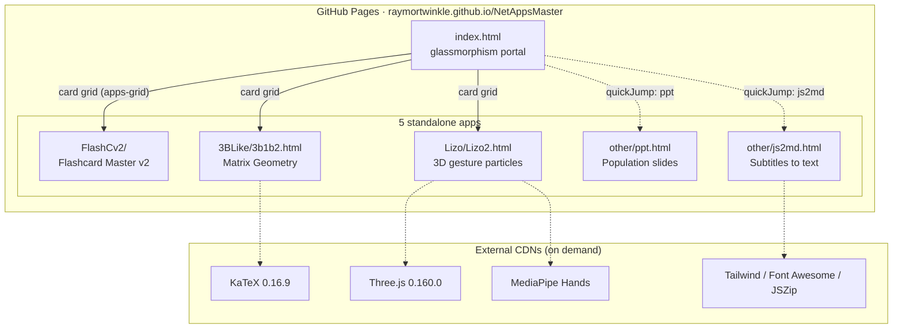
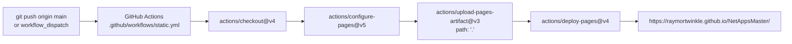
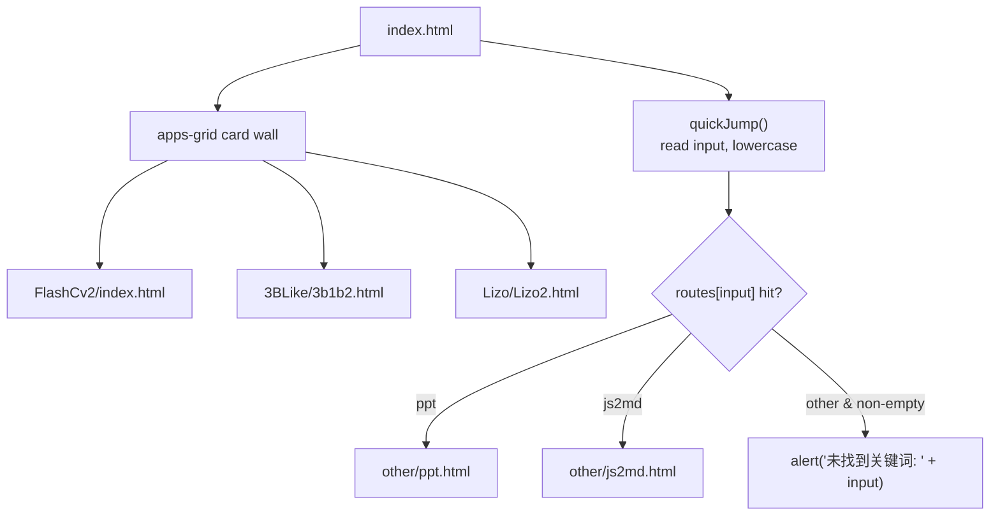
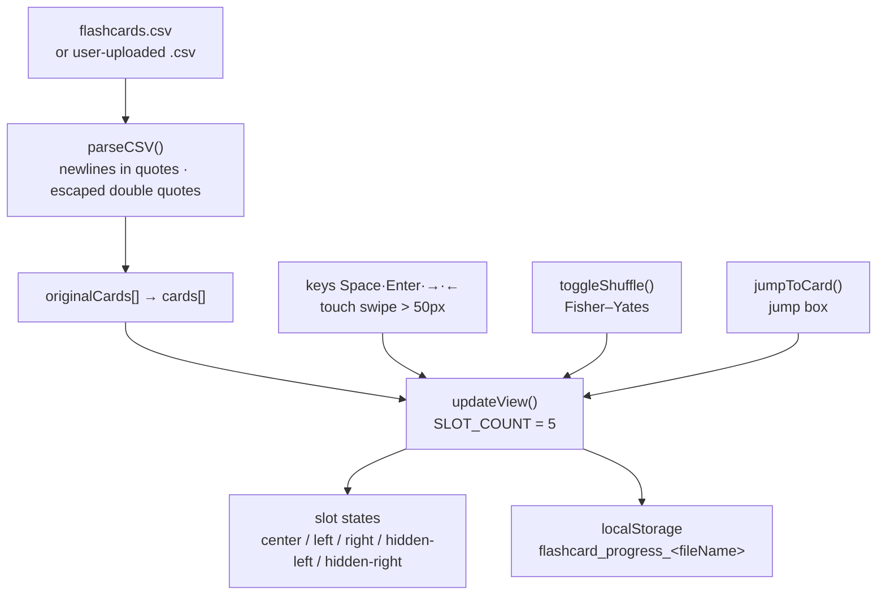
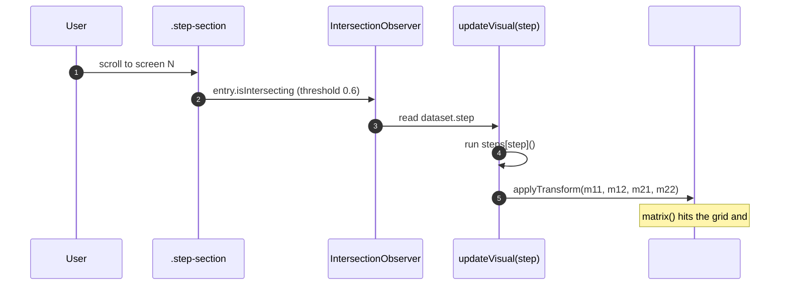
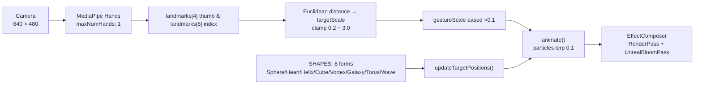
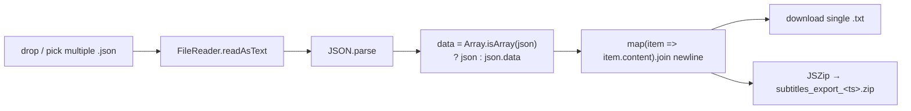

<div align="center">

> **English** | [简体中文](./README.md)



# NetAppsMaster · A Little Collection of Web Toys

**One doorway to five instantly-playable web apps — zero install, zero build, pure static.**

A static portfolio written in plain HTML / CSS / JavaScript: open `index.html` and you get a navigation portal.
Behind each little card lives a standalone toy — from CSV flashcards and a 3B1B-style linear-algebra animation,
to camera-driven gesture particles, a pure-CSS slide deck, and batch subtitle extraction.


</div>

---

## Why it exists

Ray built a pile of "little web toys", but they were scattered with no single entrance — playing any one of them meant
first hunting down the right file or link. Sharing them one by one was neither memorable nor discoverable.

**NetAppsMaster gathers them into a static "app portal":** the root `index.html` shows every app as a glassmorphism
card wall, plus a keyword quick-jump box. Each app lives in its own subdirectory, independent of the others, so it can
be opened or shared on its own. The whole site is static files; pushing to GitHub lets Actions publish it to GitHub Pages
automatically — **no build step, no bundler, no `node_modules`**.

> All logic runs in your browser. The only network need is a handful of CDN libraries
> (KaTeX / Three.js / MediaPipe, etc.), plus camera permission for the gesture-particle app.

---

## ✨ Features

- 🧭 **Glassmorphism portal**: `index.html` lays out every app in a card grid; a built-in `quickJump()` keyword router (type `ppt` / `js2md` to jump straight to a page).
- 🎴 **Flashcard Master v2 (FlashCv2)**: upload any `.csv` and study with a 5-slot CoverFlow card stream — flip, shuffle (Fisher–Yates), jump, and per-file progress remembered in `localStorage`.
- 📐 **Matrix Geometry Intuition (3BLike)**: a 3Blue1Brown-style, scroll-driven linear-algebra lesson. The pinned left stage applies matrix transforms live as you scroll, with KaTeX-rendered formulas, across 9 screens on orthogonal / symmetric / similar diagonalization / quadratic forms / exam strategy.
- 🎨 **Lizo2 Enhanced**: a 3D gesture-driven particle system built on Three.js + MediaPipe Hands. Pinch thumb and index to zoom, with 8 geometry shapes and 3 color modes, plus UnrealBloom glow post-processing.
- 📊 **East Asia Population deck (other/ppt.html)**: an 8-slide, 16:9 presentation written in pure CSS/HTML — arrow-key navigation, fullscreen button, immersive dark typography.
- 🗂️ **JSON subtitles → plain text (other/js2md.html)**: drop multiple `.json` subtitle files, batch-extract the `content` field, download `.txt` one by one or bundle them into a `.zip` via JSZip — entirely in the local browser, nothing uploaded.

---

## 🚀 Quick Start

### Option 1: For AI Agents (one-shot prompt)

Send the following to your local AI Agent (Claude Code / Codex / OpenCode …):

````markdown
Please get NetAppsMaster running locally for me (GitHub: https://github.com/RayMorTwinkle/NetAppsMaster).
Context: it is a pure-static collection of little web toys; the root index.html is the navigation portal,
with no build step and no dependencies.

Steps:
1. Clone: git clone https://github.com/RayMorTwinkle/NetAppsMaster.git && cd NetAppsMaster
2. Start a local static server (the gesture-particle app needs localhost to get camera permission):
   python3 -m http.server 8000
3. Open http://localhost:8000 — you should see a glassmorphism card wall with entries for
   Flashcard Master v2 / Matrix Geometry Intuition / Lizo2.
4. Verify each: clicking a card opens the right page; typing ppt or js2md in the home quick-jump box navigates.
5. Briefly tell the user what the 5 apps are, and remind them Lizo2 needs camera permission.
````

### Option 2: For humans

```bash
git clone https://github.com/RayMorTwinkle/NetAppsMaster.git
cd NetAppsMaster

# Pick either:
open index.html                 # open directly (Lizo2's camera may be unavailable over file://)
python3 -m http.server 8000     # or serve locally, then visit http://localhost:8000 (recommended)
```

> **Requirements**: any modern browser — **no install, no build**.
> Online, the apps pull KaTeX / Three.js / MediaPipe / Tailwind / Font Awesome / JSZip from CDNs;
> `Lizo/Lizo2.html` needs **camera permission** and is best served over `localhost` or HTTPS (browser secure-context rule).

---

## 🖥️ Usage

### The five apps at a glance

| Entry | Name | How to open | One-line capability |
|---|---|---|---|
| `index.html` | Navigation portal | Site root | Card wall + keyword quick-jump |
| `FlashCv2/index.html` | Flashcard Master v2 | Home card 🚀 | CSV flashcards: CoverFlow + progress memory |
| `3BLike/3b1b2.html` | Matrix Geometry Intuition | Home card 📐 | Scroll-driven linear-algebra visualization |
| `Lizo/Lizo2.html` | Lizo2 Enhanced | Home card 🎨 | Gesture-controlled 3D particles |
| `other/ppt.html` | East Asia Population deck | Home keyword `ppt` | 8-slide CSS presentation |
| `other/js2md.html` | JSON subtitles → text | Home keyword `js2md` | Batch `.json` → `.txt` / `.zip` |

> Note: `ppt.html` and `js2md.html` are **not on the home card wall**; they are reachable only via the home
> "quick jump" keyword box (the `routes` table in `index.html`).

### Typical workflows

```text
Flashcard Master v2
───────────────────
1. Open FlashCv2/index.html
2. Click "示例词汇" (Sample Vocabulary) to try instantly, or "选择文件" to upload your own .csv (two columns: question,answer)
3. Space flips · Enter / → next · ← previous · jump box for a page · shuffle button to randomize
4. Reopen the same file later and it resumes where you left off

Matrix Geometry Intuition
─────────────────────────
Scroll the right column: orthogonal → symmetric → similar diagonalization P D P⁻¹ → three properties → quadratic forms → four-step exam strategy
The left stage redraws the grid, unit circle, i / j basis vectors and the two eigen-axes for the current screen

Lizo2 view & gesture
────────────────────
1. Open it, click the loading overlay, grant camera access
2. Pinch thumb + index to zoom the particle cloud · drag with left mouse to rotate · wheel to zoom
3. The left console switches 8 shapes and 3 palettes, and has particle-density / bloom sliders

JSON subtitles → text
─────────────────────
Drop one or more .json files (shaped like [{content:"..."}] or {data:[{content:"..."}]})
→ download .txt individually, or "打包下载全部 (.zip)" to bundle them
```

---

## 🏗️ Architecture

### System overview

The site is "one portal + five apps"; sub-apps are independent, and external CDN libraries load on demand.



### Deployment pipeline

Every push to `main` (or a manual run) publishes **the entire repository root** as the Pages artifact.



### Home navigation routing

Two paths from the home page: direct cards, and the `quickJump()` keyword route table.



### Flashcard data flow (FlashCv2)

CSV goes through an enhanced parser into memory; the 5 slots are assigned `center / left / right / hidden-*` by distance from center.



### Scroll-driven lesson (3BLike)

The scrolling right column drives the visual stage on the left via `IntersectionObserver` (`threshold: 0.6`).



### Gesture particle pipeline (Lizo2)

Camera frame → MediaPipe Hands landmarks → pinch distance → eased scale → particles lerp to targets → bloom composite.



### Subtitle conversion (js2md)



---

## 📂 Project layout

```text
NetAppsMaster/
├── index.html                 # portal: card wall + quickJump keyword routing
├── assets/
│   └── logo.svg               # site icon (layers glyph)
├── FlashCv2/                  # App 1: Flashcard Master v2
│   ├── index.html             #   upload screen + CoverFlow main UI
│   ├── styles.css             #   glassmorphism cards and 3D stage styles
│   ├── script.js              #   CSV parse / slot render / progress memory / shuffle
│   └── flashcards.csv         #   preset deck (computer-basics Q&A, ~310 lines)
├── 3BLike/
│   └── 3b1b2.html             # App 2: Matrix Geometry (single file, inline CSS/JS)
├── Lizo/
│   └── Lizo2.html             # App 3: 3D gesture particles (single file, ES Module)
├── other/
│   ├── ppt.html               # App 4: East Asia Population deck (single file)
│   └── js2md.html             # App 5: JSON subtitles to text (single file)
└── .github/
    └── workflows/
        └── static.yml         # GitHub Pages auto-deploy workflow
```

---

## 🔧 Technical notes

**A buildless static site.** There is no `package.json`, no bundler, no `node_modules`; `static.yml` uploads `path: '.'`
(the whole repository root) as the Pages artifact, so **every file in the repo is published as-is**.

**Deploy triggers.** The workflow runs on `on.push.branches: ["main"]` plus `workflow_dispatch` (manual); permissions are
`contents: read` / `pages: write` / `id-token: write`, and the concurrency group is `"pages"` (`cancel-in-progress: false`).

**Home keyword route table.** The inline `quickJump()` in `index.html` lowercases the input and looks it up:

| Keyword | Target |
|---|---|
| `ppt` | `other/ppt.html` |
| `js2md` | `other/js2md.html` |

**Flashcard CoverFlow slot algorithm.** `SLOT_COUNT = 5` (`script.js`). `updateView()` computes
`dist = slotIndex - (currentIndex % slotCount)`, normalizes it to `[-2, 2]`, and assigns the slot a
`center` / `left` / `right` / `hidden-left` / `hidden-right` class; clicking the center flips, clicking left/right goes prev/next.

**Flashcard parsing & persistence.** `parseCSV()` is a hand-written state machine handling `\r\n`/`\r` normalization,
newlines inside quotes, and `""` escaping, yielding `{q, a}` records. The progress key is ``flashcard_progress_${fileName}``,
written only in non-shuffle state. The preset deck loads via `fetch('flashcards.csv')`, falling back to the built-in
`getExampleCSVContent()` on failure.

**3B1B visual transform.** The grid uses `range = 20` and `spacing = 50px`. `applyTransform(m11, m12, m21, m22)` applies a
`matrix()` to `#grid-lines-layer` (**the unit circle `#unit-circle` is a child, so it deforms too**), then recomputes
`#vec-i` / `#vec-j` length and angle. The stage is flipped with `gridWorld.style.transform = "scaleY(-1)"` to suit math
conventions. Steps 0–8 are driven by the `steps` object; key matrices: orthogonal `Q` (cos/sin 45°), symmetric
`A = [[2,1],[1,2]]`, diagonal `D = [[3,0],[0,1]]`.

**Lizo2 key parameters.** `MAX_PARTICLES = 60000`, default `CONFIG.particleCount = 20000` (slider 1000–50000), default
bloom `bloomStrength = 0.8` (range 0–3). Gesture scale comes from the Euclidean distance `d` between thumb (4) and index (8):
`targetScale = clamp(d * 5, 0.2, 3.0)`, eased with `+= (target - current) * 0.1`. Render chain is `EffectComposer`:
`RenderPass → UnrealBloomPass`; controls are `OrbitControls` (`dampingFactor 0.05`). The Three.js version is pinned to
`0.160.0` via `importmap`.

**Slides & subtitle tool edge cases.** `ppt.html` is a fixed `1280×720` stage; key listeners map
`ArrowRight / Space / Enter` to next and `ArrowLeft` to previous. `js2md.html` accepts only files ending in `.json`,
supporting both a top-level array and a `{data: []}` shape, extracting each item's `content` and joining with newlines.

---

## ❓ FAQ

**Q: Do I need to install anything?**
A: Nothing. It is pure static files — double-click `index.html` or serve it; no dependencies, no build step.

**Q: Lizo2 can't open the camera / says startup failed?**
A: Browsers grant camera access only in a **secure context**. Serve via `http://localhost:8000` or HTTPS, not `file://`,
and make sure you allowed the camera in the prompt.

**Q: What CSV format do flashcards use?**
A: Two columns, `question,answer`. The parser supports fields wrapped in double quotes, newlines inside quotes, and
`""` for a literal double quote (see `parseCSV()`).

**Q: Why can't I see `ppt` and `js2md` on the home page?**
A: They are not cards. Type the keyword `ppt` or `js2md` into the home "quick jump" box to open them.

**Q: Are my uploaded files sent to a server?**
A: No. The flashcard and subtitle tools process everything locally in the browser via `FileReader` / `Blob`, and the page
explicitly states "files are not uploaded to any server".

---

## ⚠️ Notes

- **Network dependencies**: several apps load third-party libraries from public CDNs (KaTeX, Three.js, MediaPipe,
  Tailwind, Font Awesome, JSZip). Offline, or where CDNs are blocked, the corresponding features will not work.
- **`Lizo/Lizo2.html` retains AI Studio scaffolding references**: it references `/index.css` and `/index.tsx` at the end,
  and `preconnect`s to `aistudiocdn.com`. These paths **do not exist** in the repo and will 404 in the console, without
  affecting the main functionality. (Whether this is intentional is to be confirmed.)
- **`other/ppt.html` images are placeholders**: `` points to placeholder
  resources that most likely will not render; the slide text content is complete.
- **Third-party asset rights**: the deck, preset deck, and other content include third-party material — mind licensing
  before redistributing.
- **This repo has no license file**, so all rights are reserved by default (see below).

---

## 📄 License

This repository currently ships **no open-source license file**. Until a license (e.g. MIT) is added, all rights are
reserved by default; please contact the author before reuse.

---

## 🙏 Credits

- The teaching structure of the **3B1B interactive linear algebra** pays tribute to
  [3Blue1Brown](https://www.3blue1brown.com/)'s series; formulas are rendered by [KaTeX](https://katex.org/).
- **Lizo2** is built on [Three.js](https://threejs.org/) and [MediaPipe Hands](https://developers.google.com/mediapipe).
- **FlashCv2** icons come from [Font Awesome](https://fontawesome.com/); **js2md**'s bundling relies on
  [JSZip](https://stuk.github.io/jszip/); some styling uses [Tailwind CSS](https://tailwindcss.com/).
- The site icon, README (bilingual) and architecture diagrams are produced for this repository.

---

<div align="center">
<sub>NetAppsMaster · all the little toys, behind one door</sub>
</div>
